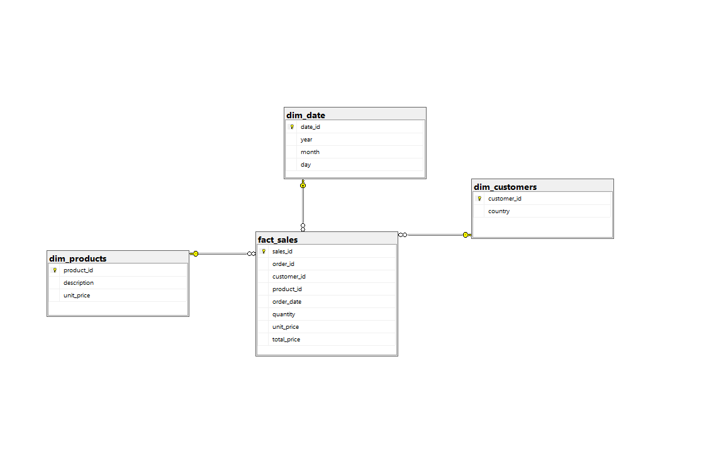
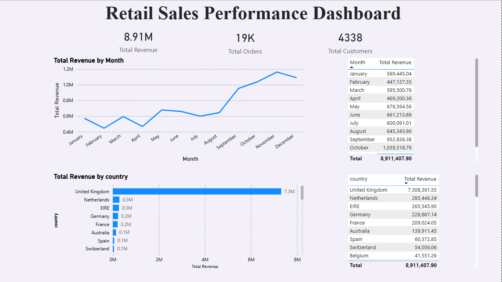
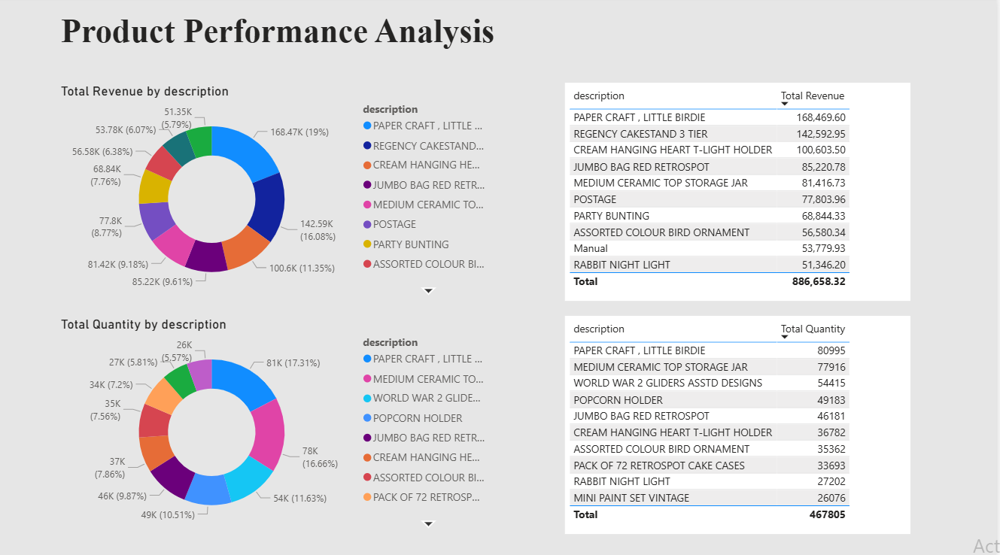
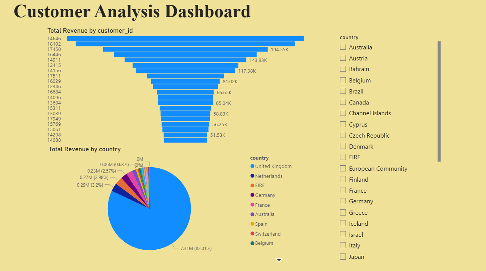
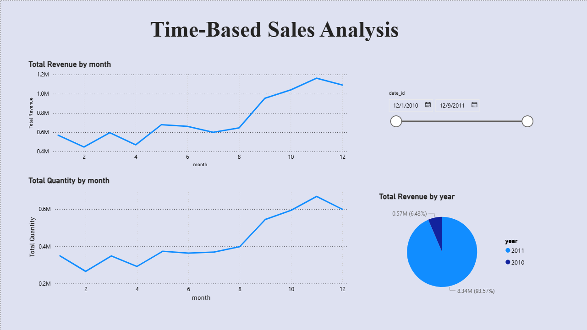

# Retail Sales Analytics Project

## Overview

This project demonstrates an end-to-end data analytics workflow using Excel, SQL Server, and Power BI.

The goal was to transform raw retail transaction data into a structured data warehouse and build an interactive dashboard to generate business insights.

The project includes:

- Data cleaning using Excel and SQL
- ETL pipeline implementation
- Star schema data modeling
- SQL-based analysis
- Power BI dashboard development

---

## Business Problem

Retail transaction data is often unstructured and difficult to analyze efficiently.

The objective of this project was to:

- Structure raw data into an analytical format
- Enable fast and scalable queries
- Identify key revenue drivers
- Analyze customer and product performance

---

## Dataset

- Source: Online Retail Dataset from https://archive.ics.uci.edu/ml/datasets/Online+Retail
- Records: ~397,000 rows

The dataset contains:

- Orders (InvoiceNo)
- Products (StockCode, Description)
- Customers (CustomerID)
- Quantity and pricing
- Order timestamps
- Country-level data

---

## Data Architecture

A **Star Schema** was implemented to support analytical queries.

### Fact Table
- `fact_sales` → transactional sales data

### Dimension Tables
- `dim_customers`
- `dim_products`
- `dim_date`

### Schema Diagram



---

## ETL Process

### Extract
- Imported raw data from Excel into SQL Server (`staging_retail`)

### Transform

Initial cleaning in Excel:
- Removed data such as orders without Customer_id, negative quantity etc
- Created `TotalPrice` column
- Prepared dataset for import

SQL transformations:
- Removed NULL customer records
- Deduplicated customer data
- Standardized product records
- Generated date dimension

### Load

Data loaded into:

- `dim_customers`
- `dim_products`
- `dim_date`
- `fact_sales`

---

## SQL Analysis

Key analytical queries include:

- Monthly revenue trend
- Top products by revenue
- Customer lifetime value (CLV)
- Revenue by country
- Running totals using window functions
- Monthly Grow percentage

---

## Power BI Dashboard

The dashboard consists of four pages:

### Executive Overview
- Total Revenue
- Total Orders
- Total Customers
- Revenue Trend
- Revenue by Country

### Product Performance
- Top Products
- Revenue Distribution
- Quantity Sold

### Customer Analysis
- Top Customers
- Revenue by Country
- Customer value distribution

### Time Analysis
- Monthly revenue trends
- Seasonal patterns

---

## Dashboard Preview

### Executive Overview


### Product Performance


### Customer Analysis


### Time Analysis

---

## Tools Used

- Excel → Data cleaning
- SQL Server → Data storage and ETL
- SQL → Data transformation and analysis
- Power BI → Data visualization

---

## Key Insights

Detailed analysis can be found here:

[View Business Insights](insights.md)

## Project Structure
```text
retail-analytics-sql-server/

├── data/
│   ├── raw/
│   ├── cleaned/
├── sql/
│   ├── 01_create_tables.sql
│   ├── 02_insert_data.sql
│   ├── 03_analysis_queries.sql
├── powerbi/
│   └── retail_dashboard.pbix
├── images/
│   ├── star_schema.png
│   ├── dashboard_page1.png
│   ├── dashboard_page2.png
│   ├── dashboard_page3.png
│   ├── dashboard_page4.png
├── insights/
│   └── business_insights.md
└── README.md